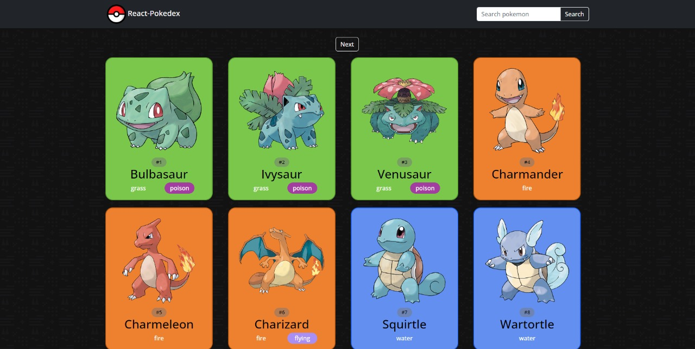
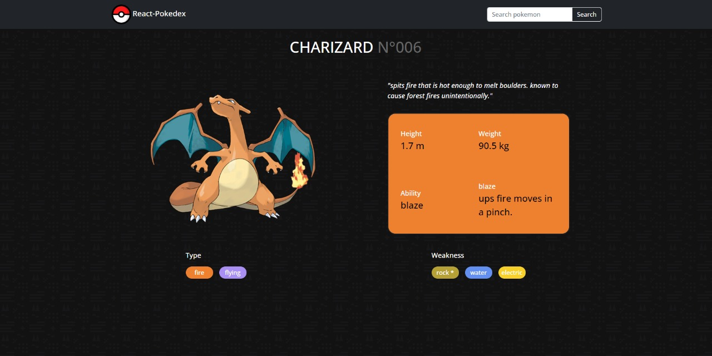

# React Pokedex
###### By Asmith Dahjer

---

this is a simple react app that consume the [Pokeapi](https://pokeapi.co) to look like a pokedex, slightly inspired by the official [Pokemon pokedex](https://www.pokemon.com/el/pokedex/).

In this app you can see the list of 1154 pokemon, search them by name and by pokedex number. Also have an individual page with more information of each one.

---
## Images

- Main Page


- Pokemon extra information Page


---

## How to run it

- To run this project first of all you need to clone this repo:
`git clone https://github.com/ADahjer/react-pokedex.git`


- then you'll need to install all the necessary dependencies to run this project
```bash
$ npm install
```

- Now you can run the project by executing the following command

```bash
$ npm start
```

- Go to [Localhost:3000](http://localhost:3000/) and there would be the app.